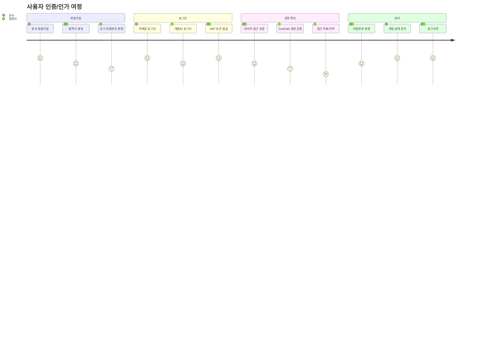
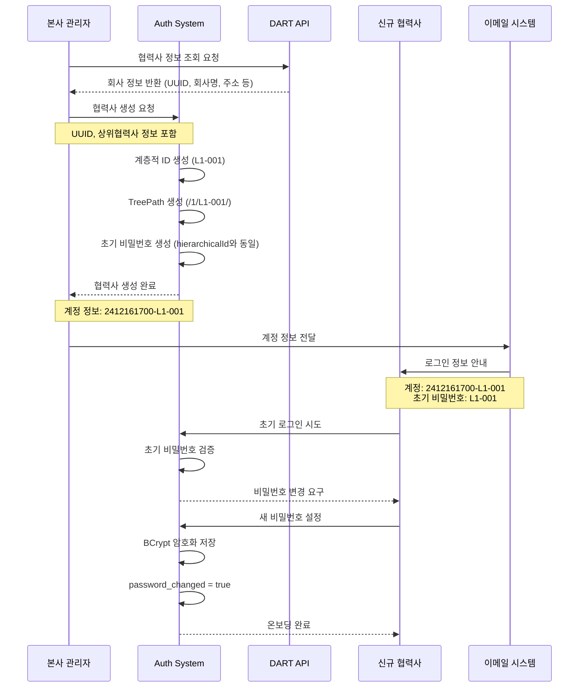
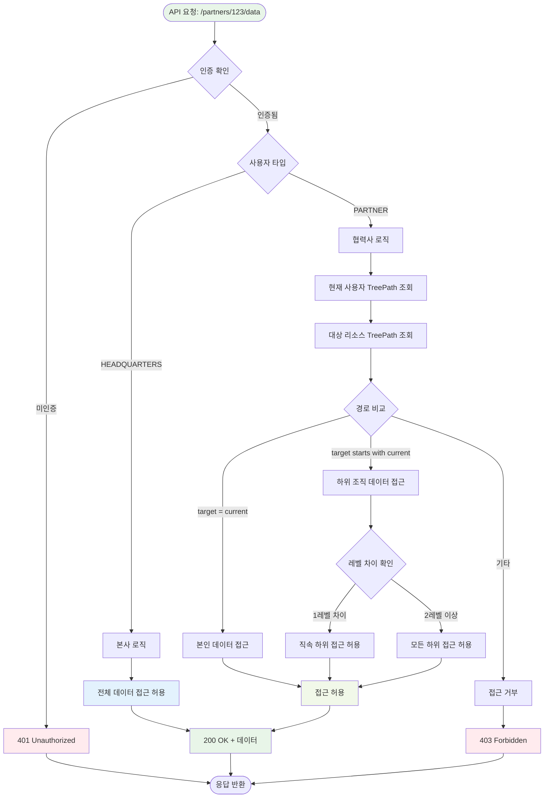
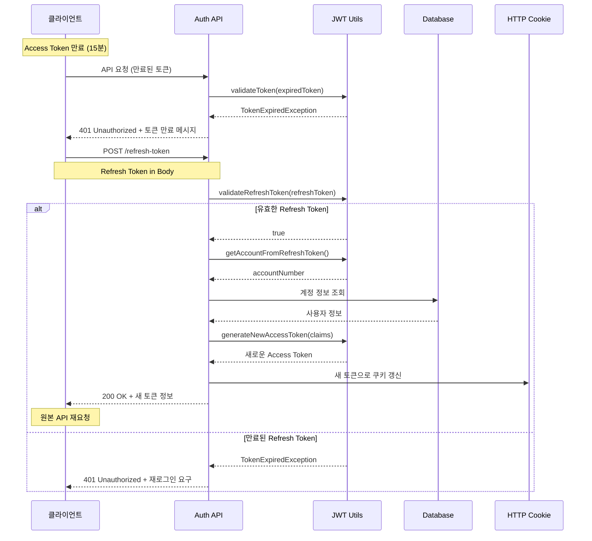
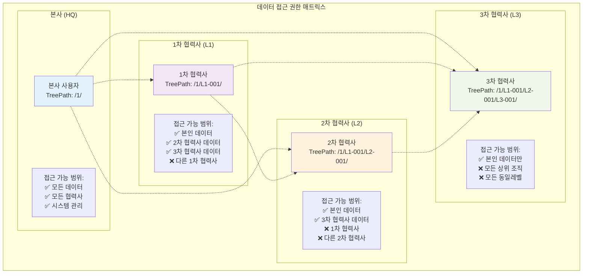
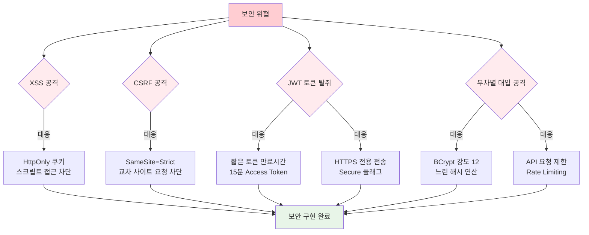
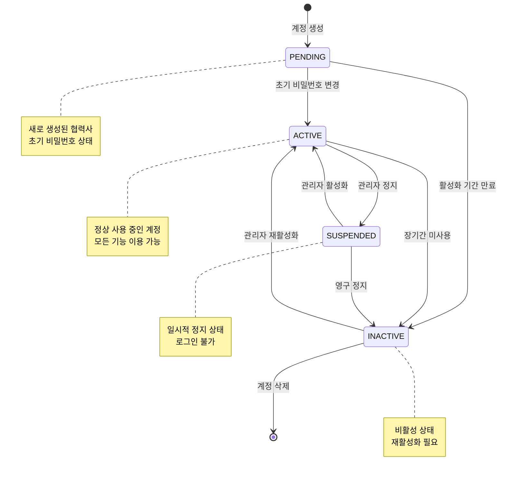
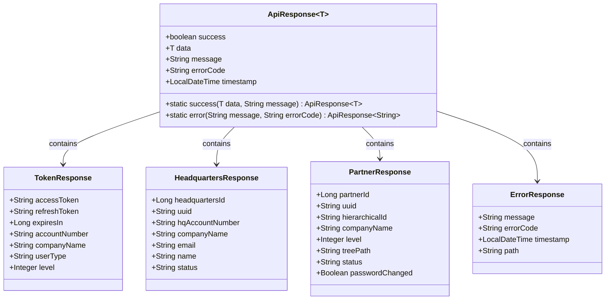

# Auth Service 비즈니스 플로우 다이어그램

## 1. 전체 사용자 여정 맵

## 2. 협력사 온보딩 프로세스

## 3. 멀티레벨 권한 검증 플로우

## 4. JWT 토큰 갱신 플로우

## 5. 계층별 데이터 접근 패턴

## 6. 보안 위협 및 대응 플로우

## 7. 계정 상태 관리 상태 다이어그램

## 8. API 응답 표준화 구조

이러한 비즈니스 플로우 다이어그램들을 통해 Auth Service의 실제 운영 시나리오와 사용자 경험을 명확하게 보여줄 수 있습니다!