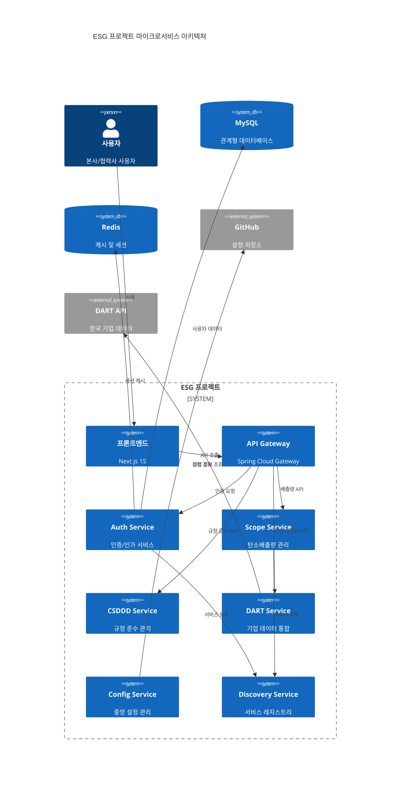
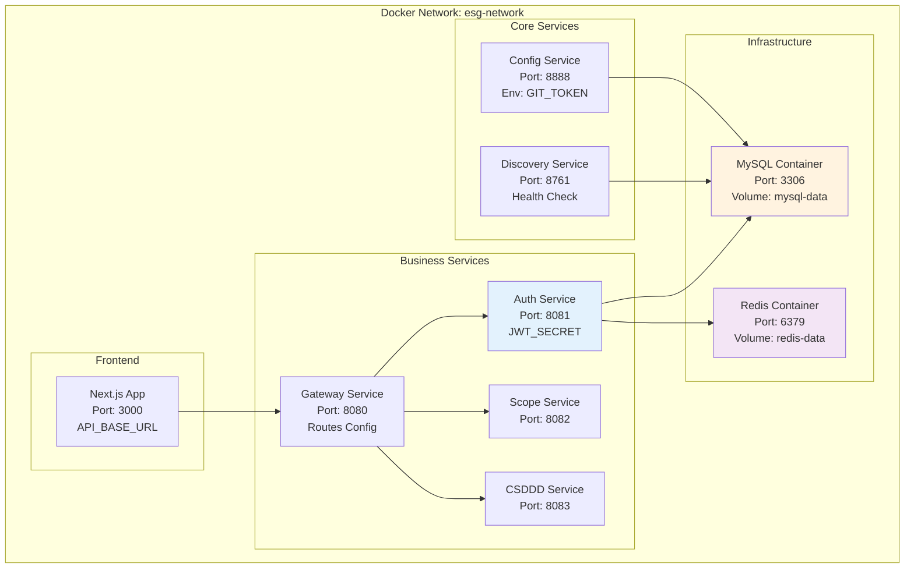
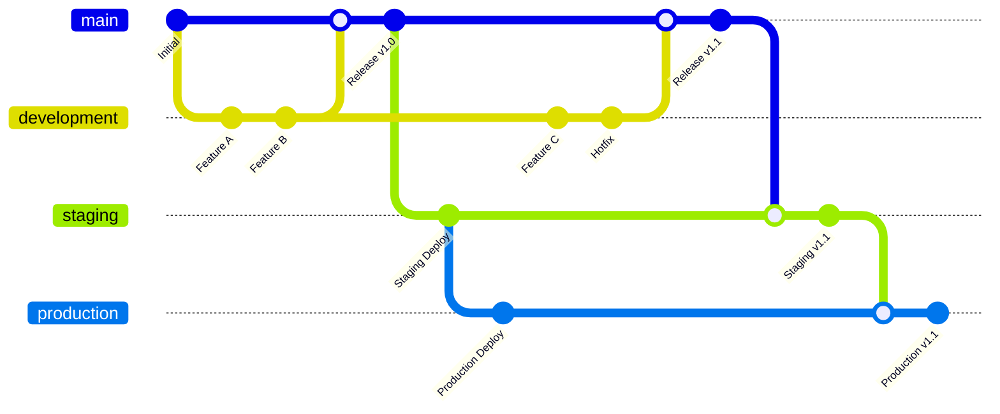
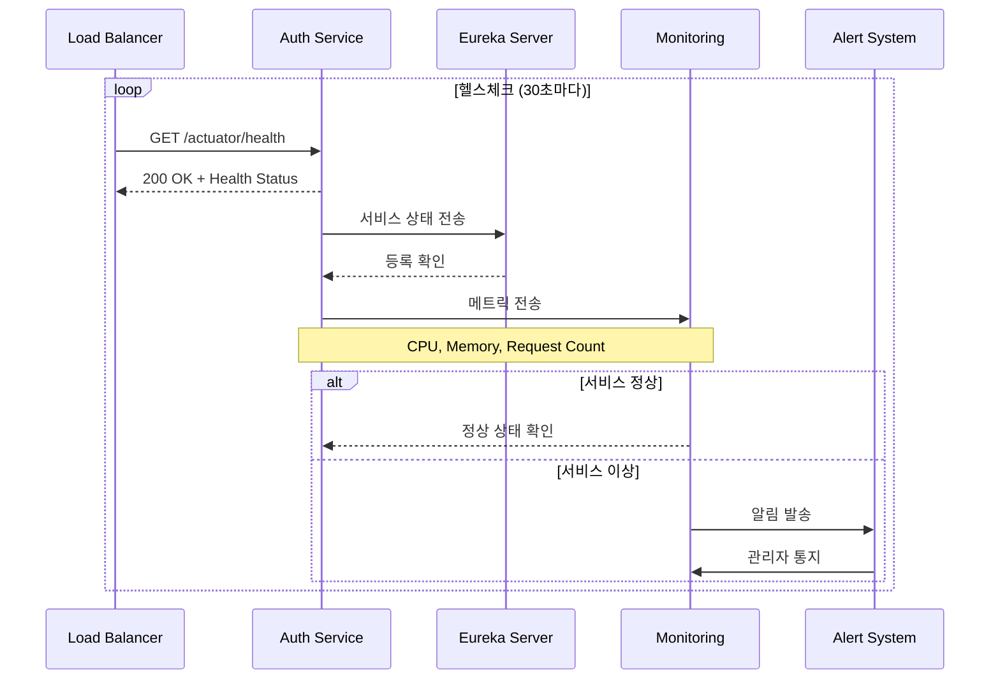
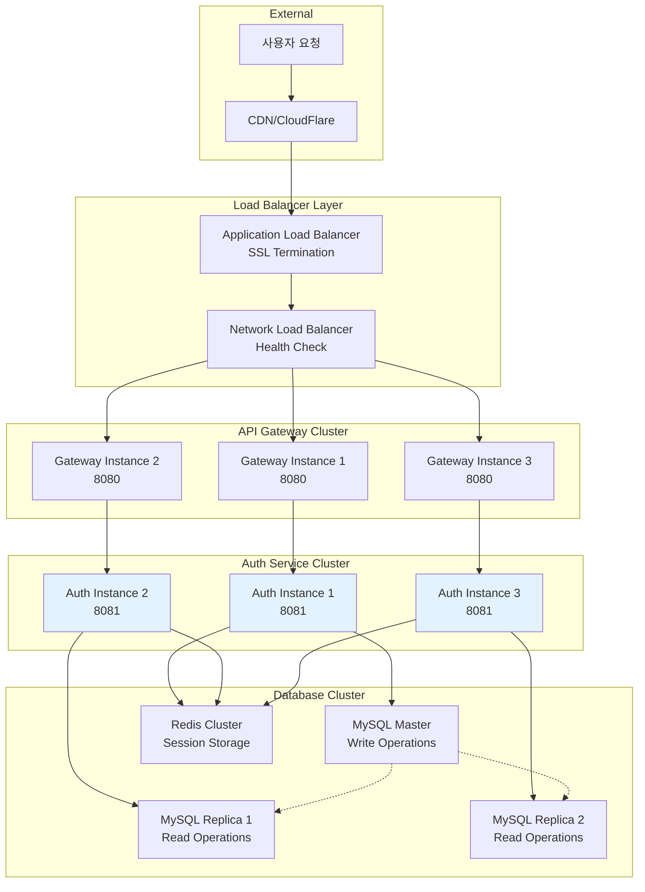
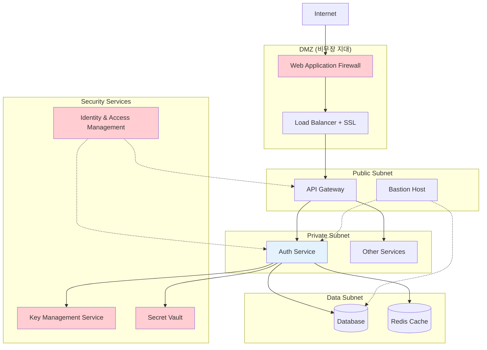
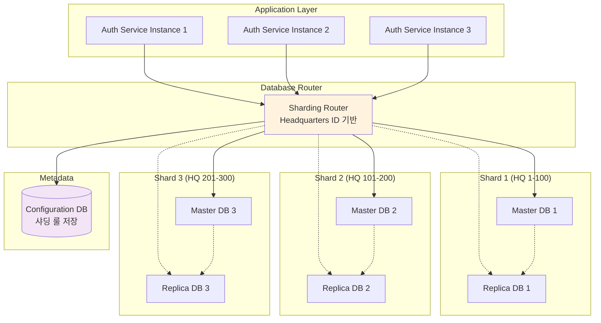

# Auth Service 배포 및 시스템 구성 다이어그램

## 1. 마이크로서비스 전체 아키텍처

## 2. Docker 컨테이너 구성

## 3. 환경별 배포 전략

## 4. 서비스 헬스체크 및 모니터링

## 5. 로드 밸런싱 및 확장성

## 6. CI/CD 파이프라인

```mermaid
flowchart LR
    subgraph "개발 단계"
        DEV[개발자 코드 작성]
        COMMIT[Git Commit & Push]
    end
    
    subgraph "CI 단계"
        TRIGGER[GitHub Actions 트리거]
        BUILD[Gradle Build]
        TEST[단위 테스트 실행]
        QUALITY[코드 품질 검사]
        SECURITY[보안 스캔]
    end
    
    subgraph "CD 단계"
        DOCKER_BUILD[Docker 이미지 빌드]
        REGISTRY[Container Registry 푸시]
        DEPLOY_STG[Staging 배포]
        E2E_TEST[E2E 테스트]
        DEPLOY_PROD[Production 배포]
    end
    
    subgraph "모니터링"
        HEALTH[헬스체크]
        METRICS[메트릭 수집]
        LOGS[로그 수집]
        ALERTS[알림 설정]
    end
    
    DEV --> COMMIT
    COMMIT --> TRIGGER
    TRIGGER --> BUILD
    BUILD --> TEST
    TEST --> QUALITY
    QUALITY --> SECURITY
    
    SECURITY --> DOCKER_BUILD
    DOCKER_BUILD --> REGISTRY
    REGISTRY --> DEPLOY_STG
    DEPLOY_STG --> E2E_TEST
    E2E_TEST --> DEPLOY_PROD
    
    DEPLOY_PROD --> HEALTH
    HEALTH --> METRICS
    METRICS --> LOGS
    LOGS --> ALERTS
    
    style BUILD fill:#e8f5e8
    style TEST fill:#e8f5e8
    style DEPLOY_PROD fill:#e3f2fd
```

## 7. 보안 아키텍처

## 8. 데이터베이스 샤딩 전략

이러한 배포 및 시스템 구성 다이어그램들을 통해 Auth Service가 실제 운영 환경에서 어떻게 확장되고 관리되는지를 포트폴리오에서 효과적으로 보여줄 수 있습니다!