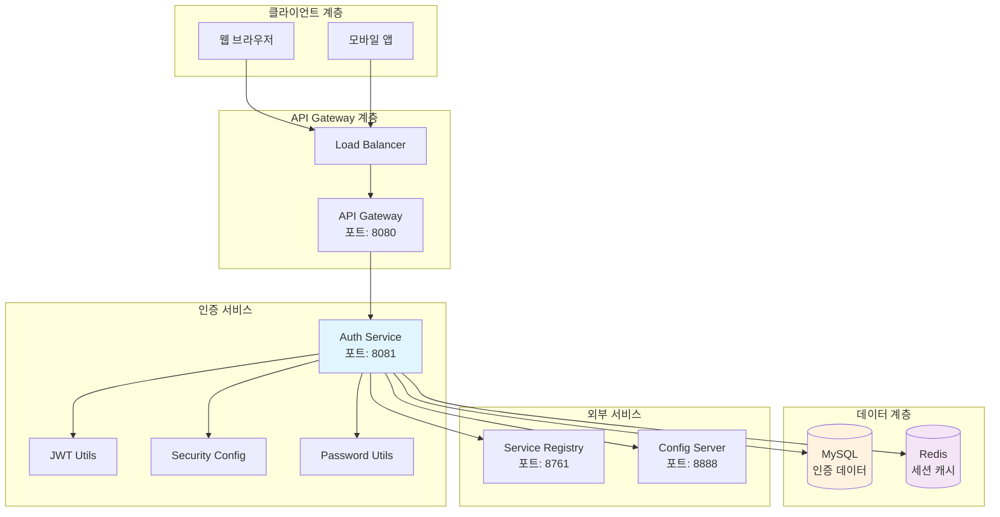
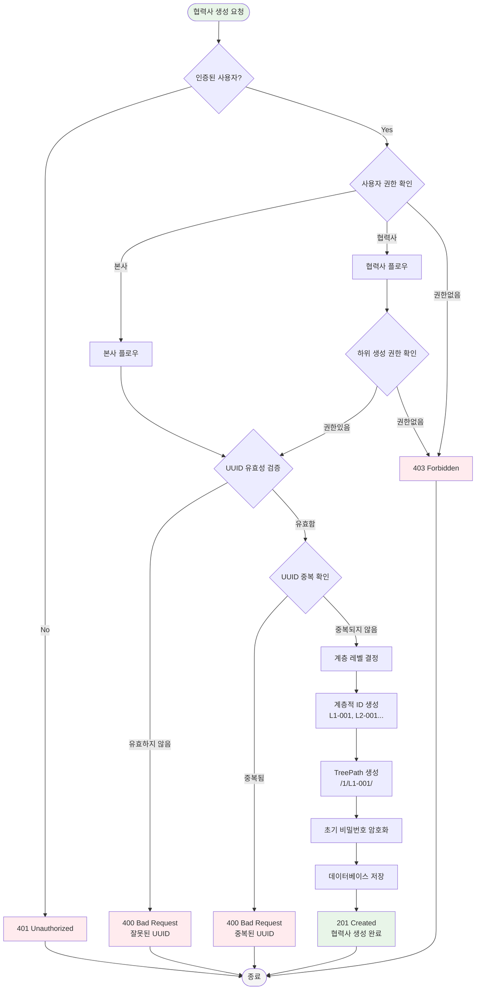
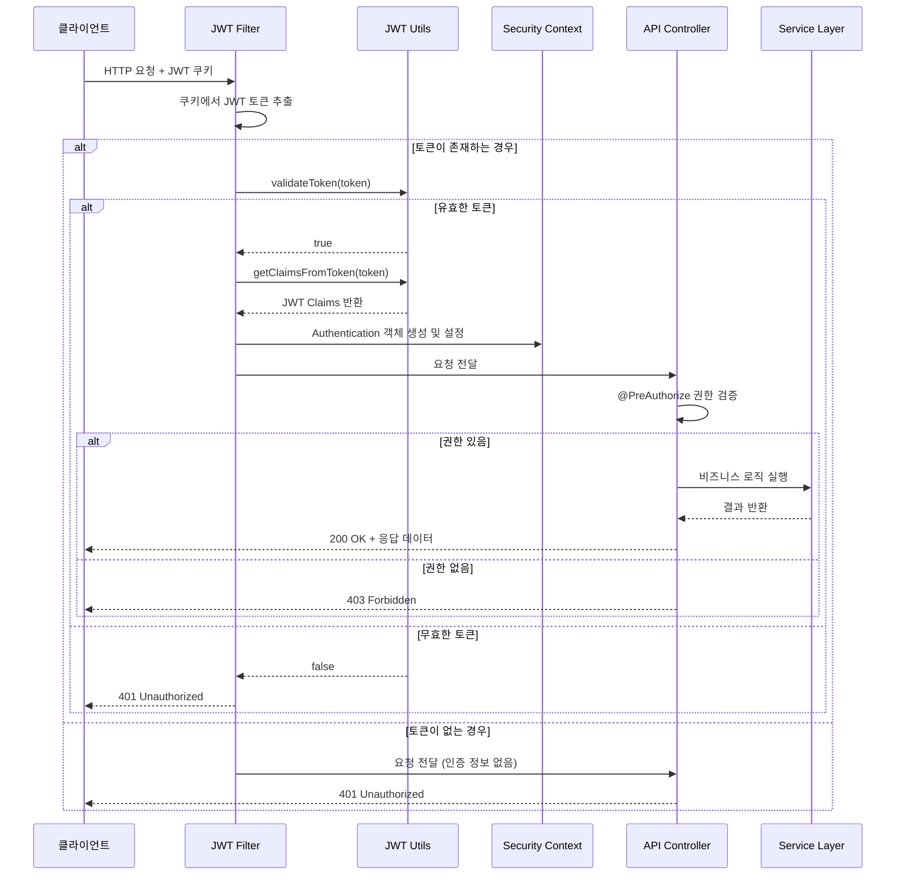
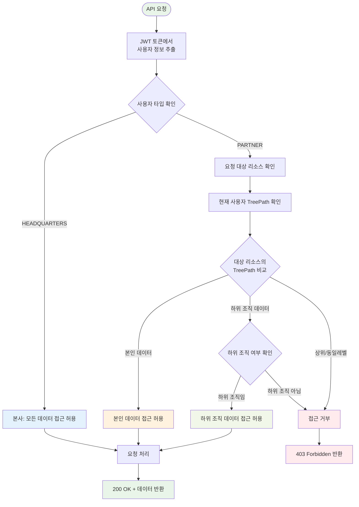
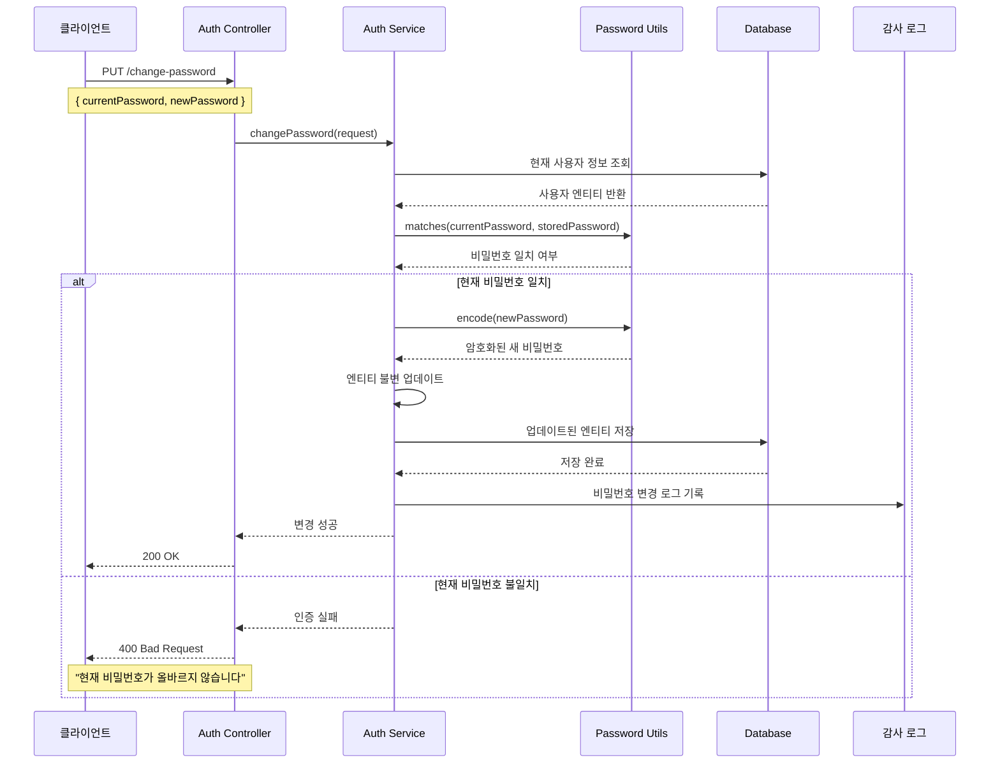
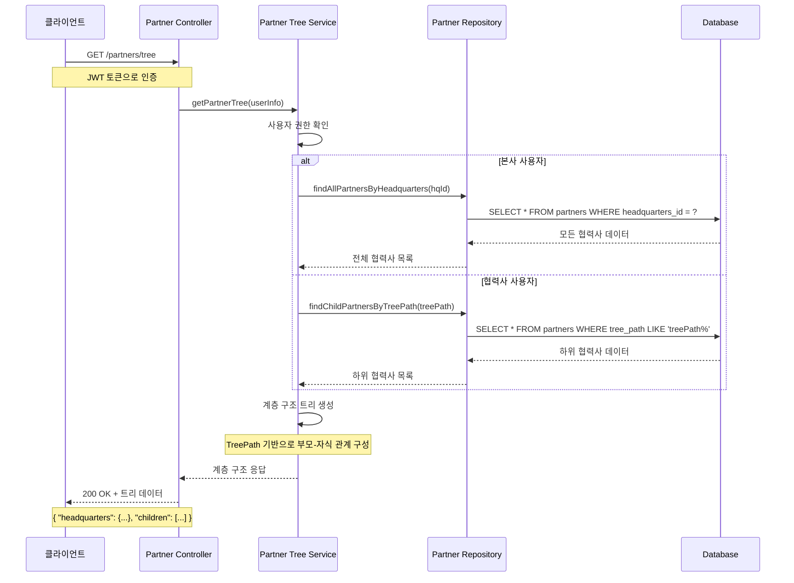
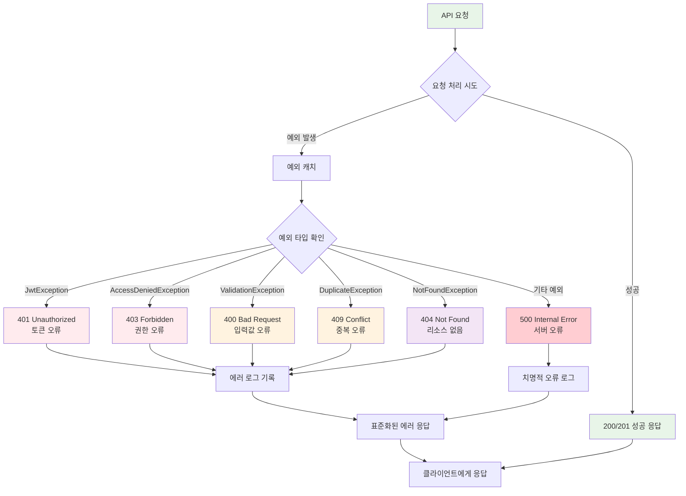
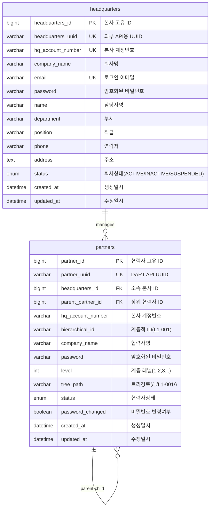
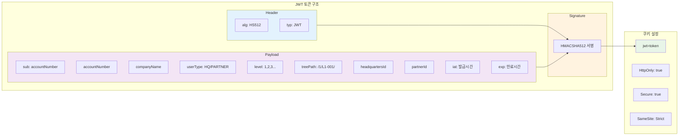

# Auth Service Mermaid 다이어그램 모음

## 1. 전체 시스템 아키텍처 플로우차트

## 2. 협력사 생성 플로우차트

## 3. JWT 토큰 검증 시퀀스 다이어그램

## 4. 계층적 권한 검증 플로우차트

## 5. 비밀번호 변경 시퀀스 다이어그램

## 6. 협력사 계층 구조 조회 시퀀스 다이어그램

## 7. 에러 처리 플로우차트

## 8. 데이터베이스 연관관계 ERD

## 9. JWT 토큰 구조 다이어그램

이러한 다이어그램들을 통해 Auth Service의 복잡한 인증/인가 로직과 계층적 구조를 시각적으로 명확하게 설명할 수 있습니다!