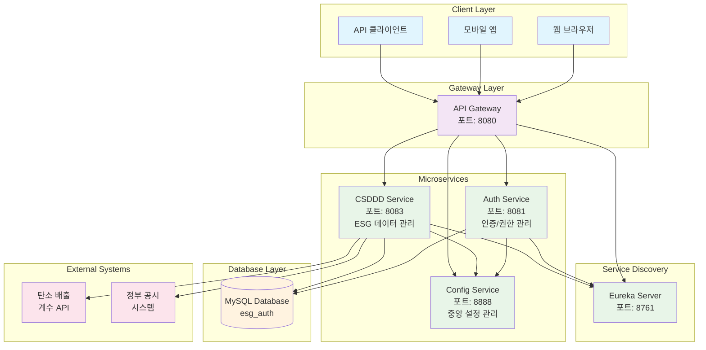
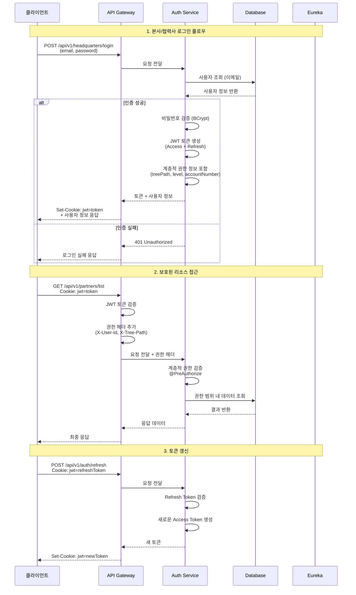

# 🔐 ESG Auth Service - 인증/권한 관리 시스템

> **Spring Boot 3.5 기반 마이크로서비스 아키텍처**  
> 계층적 조직 구조를 지원하는 JWT 인증 시스템

[](https://spring.io/projects/spring-boot)
[](https://spring.io/projects/spring-security)
[](https://openjdk.java.net/projects/jdk/17/)
[](https://www.mysql.com/)
[](https://github.com/jwtk/jjwt)

## 📋 프로젝트 개요

ESG Auth Service는 **대기업과 다단계 협력사 간의 복잡한 권한 관리**를 해결하기 위해 설계된 엔터프라이즈급 인증 시스템입니다.

### 🎯 핵심 해결 과제

- **계층적 조직 구조**: 본사 → 1차 협력사 → 2차 협력사 → N차 협력사
- **세분화된 권한 제어**: 상위 조직은 하위 조직 데이터 접근 가능, 역방향 차단
- **확장 가능한 아키텍처**: 수천 개의 협력사가 추가되어도 성능 저하 없음
- **보안 강화**: JWT 쿠키 기반 인증으로 XSS/CSRF 공격 방어

### 🏗️ 시스템 아키텍처



## 🔄 인증 플로우



## 🛠️ 기술 스택

### Core Framework

- **Spring Boot 3.5.0** - 최신 버전의 엔터프라이즈 프레임워크
- **Spring Security 6.x** - 인증/인가 및 보안 관리
- **Spring Data JPA** - 데이터 접근 계층 추상화
- **Spring Cloud 2025.0.0** - 마이크로서비스 인프라

### Security & Authentication

- **JWT (JJWT 0.11.5)** - 토큰 기반 stateless 인증
- **BCrypt** - 비밀번호 해싱 알고리즘
- **HttpOnly Cookie** - XSS 공격 방어

### Database & ORM

- **MySQL 8.0** - 메인 데이터베이스
- **Hibernate** - JPA 구현체
- **HikariCP** - 고성능 커넥션 풀

### Microservice Infrastructure

- **Netflix Eureka** - 서비스 디스커버리
- **Spring Cloud Config** - 중앙집중식 설정 관리
- **Spring Cloud Gateway** - API 게이트웨이

### Development & Documentation

- **OpenAPI 3 / Swagger** - API 문서 자동 생성
- **Lombok** - 보일러플레이트 코드 제거
- **Spring Boot Actuator** - 운영 모니터링

## 🏢 계층적 조직 관리 시스템

### 조직 구조 모델

```
본사 (Headquarters)
├── 1차 협력사 (Level 1 Partner)
│   ├── 2차 협력사 (Level 2 Partner)
│   │   └── 3차 협력사 (Level 3 Partner)
│   └── 2차 협력사 (Level 2 Partner)
└── 1차 협력사 (Level 1 Partner)
    └── 2차 협력사 (Level 2 Partner)
```

### Tree Path 시스템

AWS IAM과 유사한 계층적 경로 시스템을 구현했습니다:

- **본사**: `/HQ001/`
- **1차 협력사**: `/HQ001/L1-001/`
- **2차 협력사**: `/HQ001/L1-001/L2-001/`
- **3차 협력사**: `/HQ001/L1-001/L2-001/L3-001/`

### 권한 제어 로직

```java
// 계층적 권한 검증 예시
@PreAuthorize("@securityUtil.canAccessPartnerData(#partnerId)")
public PartnerResponse getPartnerData(String partnerId) {
    // 현재 사용자의 treePath가 대상 Partner의 treePath를 포함하는지 확인
    // 예: 사용자 "/HQ001/L1-001/"가 "/HQ001/L1-001/L2-001/" 접근 시 허용
}
```

## 🔒 보안 설계

### JWT 토큰 전략

1. **Access Token (15분)**

   - 실제 API 접근용
   - 짧은 만료시간으로 보안 강화
   - 사용자 권한 정보 포함

2. **Refresh Token (7일)**
   - Access Token 갱신용
   - 긴 만료시간으로 사용자 편의성 제공
   - HttpOnly 쿠키로 XSS 방어

### 쿠키 보안 설정

```java
// JWT 쿠키 보안 설정
Cookie jwtCookie = new Cookie("jwt", token);
jwtCookie.setHttpOnly(true);      // XSS 방어
jwtCookie.setSecure(true);        // HTTPS 전용 (운영환경)
jwtCookie.setSameSite("Strict");  // CSRF 방어
jwtCookie.setMaxAge(900);         // 15분
```

### 비밀번호 정책

- **최소 8자 이상**
- **대문자, 소문자, 숫자, 특수문자 각 1개 이상**
- **BCrypt 해싱** (salt rounds: 12)
- **초기 비밀번호 강제 변경**

## 📊 핵심 기능

### 1. 본사 관리

- ✅ 회원가입 및 로그인
- ✅ 8자리 숫자 계정번호 자동 생성 (YYMMDD + 일련번호)
- ✅ 모든 협력사 데이터 접근 권한
- ✅ 협력사 계정 생성 및 관리

### 2. 협력사 관리

- ✅ 계층별 ID 자동 생성 (L1-001, L2-001, L3-001...)
- ✅ 초기 비밀번호 자동 설정 및 강제 변경
- ✅ 하위 협력사만 접근 가능한 권한 제어
- ✅ 트리 구조 기반 데이터 접근

### 3. 인증/인가

- ✅ JWT 기반 stateless 인증
- ✅ 다중 로그인 방식 지원 (이메일, 계정번호, 로그인ID)
- ✅ 메서드 레벨 보안 (@PreAuthorize)
- ✅ 자동 토큰 갱신

## 🗄️ 데이터베이스 설계

### Headquarters 테이블

```sql
CREATE TABLE headquarters (
    id BIGINT AUTO_INCREMENT PRIMARY KEY,
    hq_account_number VARCHAR(10) UNIQUE NOT NULL,  -- 8자리 숫자
    company_name VARCHAR(255) NOT NULL,
    email VARCHAR(255) UNIQUE NOT NULL,
    password VARCHAR(255) NOT NULL,                 -- BCrypt 해시
    name VARCHAR(100) NOT NULL,
    department VARCHAR(100),
    position VARCHAR(50),
    phone VARCHAR(20),
    address TEXT,
    status ENUM('ACTIVE', 'INACTIVE') DEFAULT 'ACTIVE',
    created_at TIMESTAMP DEFAULT CURRENT_TIMESTAMP,
    updated_at TIMESTAMP DEFAULT CURRENT_TIMESTAMP ON UPDATE CURRENT_TIMESTAMP
);
```

### Partner 테이블

```sql
CREATE TABLE partner (
    id BIGINT AUTO_INCREMENT PRIMARY KEY,
    headquarters_id BIGINT NOT NULL,
    parent_partner_id BIGINT,                       -- 상위 협력사 ID
    external_partner_id VARCHAR(20) UNIQUE NOT NULL, -- L1-001, L2-001 등
    aws_account_number VARCHAR(10) UNIQUE NOT NULL,   -- 8자리 숫자
    login_id VARCHAR(100) UNIQUE,                     -- 회사명 기반 로그인 ID
    company_name VARCHAR(255) NOT NULL,
    email VARCHAR(255) UNIQUE NOT NULL,
    password VARCHAR(255) NOT NULL,
    tree_path TEXT NOT NULL,                          -- /HQ001/L1-001/L2-001/
    level INT NOT NULL,                               -- 1, 2, 3...
    status ENUM('ACTIVE', 'INACTIVE', 'PENDING') DEFAULT 'PENDING',
    is_initial_password BOOLEAN DEFAULT TRUE,
    created_at TIMESTAMP DEFAULT CURRENT_TIMESTAMP,
    FOREIGN KEY (headquarters_id) REFERENCES headquarters(id),
    FOREIGN KEY (parent_partner_id) REFERENCES partner(id)
);
```

## 🚀 성능 최적화

### 1. 데이터베이스 최적화

- **HikariCP 커넥션 풀**: 최대 20개 커넥션
- **JPA 배치 처리**: batch_size=20으로 설정
- **N+1 문제 해결**: @EntityGraph 및 JOIN FETCH 활용

### 2. 보안 최적화

- **JWT 서명 캐싱**: 동일 토큰에 대한 중복 검증 방지
- **비밀번호 해싱**: BCrypt rounds=12 (보안과 성능 균형)

### 3. 네트워크 최적화

- **HTTP/2 지원**: Spring Boot 3.x 기본 설정
- **압축 활성화**: Gzip 압축으로 응답 크기 최적화

## 📈 확장성 고려사항

### 1. 수평 확장 지원

- **Stateless 설계**: JWT 토큰 기반으로 서버 간 세션 공유 불필요
- **로드밸런싱 대응**: Eureka를 통한 자동 로드 분산

### 2. 데이터베이스 확장

- **읽기 전용 복제본**: 조회 쿼리 분산 처리 가능
- **파티셔닝**: 본사별 데이터 분할 가능

### 3. 캐싱 전략

- **JWT 토큰 캐싱**: Redis 도입으로 토큰 검증 성능 향상 가능
- **권한 정보 캐싱**: 자주 조회되는 권한 정보 메모리 캐싱

## 🧪 API 사용 예시

### 본사 회원가입

```bash
curl -X POST http://localhost:8081/api/v1/headquarters/register \
  -H "Content-Type: application/json" \
  -d '{
    "companyName": "삼성전자",
    "email": "admin@samsung.com",
    "password": "Samsung123!@#",
    "name": "김철수",
    "department": "IT팀",
    "position": "부장"
  }'
```

### 로그인 (JWT 쿠키 자동 설정)

```bash
curl -X POST http://localhost:8081/api/v1/headquarters/login \
  -H "Content-Type: application/json" \
  -c cookies.txt \
  -d '{
    "email": "admin@samsung.com",
    "password": "Samsung123!@#"
  }'
```

### 협력사 생성

```bash
curl -X POST http://localhost:8081/api/v1/partners \
  -H "Content-Type: application/json" \
  -b cookies.txt \
  -d '{
    "companyName": "LG전자",
    "email": "partner@lg.com",
    "name": "박영희",
    "level": 1
  }'
```

## 🔍 모니터링 및 운영

### Actuator Endpoints

- `/actuator/health` - 서비스 상태 확인
- `/actuator/metrics` - 성능 메트릭
- `/actuator/env` - 환경 설정 확인
- `/actuator/info` - 애플리케이션 정보

### 로깅 전략

```yaml
logging:
  level:
    com.nsmm.esg.auth_service: DEBUG
    org.springframework.security: DEBUG
    org.hibernate.SQL: DEBUG
  pattern:
    file: "%d{yyyy-MM-dd HH:mm:ss.SSS} [%thread] %-5level %logger{50} - %msg%n"
```

## 🛠️ 개발 환경 설정

### 필수 환경변수

```bash
export DB_URL=jdbc:mysql://localhost:3306/esg_auth
export DB_USERNAME=esg_user
export DB_PASSWORD=esg_password
export JWT_SECRET=dev-secret-key-for-jwt-auth-service
```

### 실행 방법

```bash
# 1. MySQL 데이터베이스 생성
mysql -u root -p -e "CREATE DATABASE esg_auth;"

# 2. 애플리케이션 실행
./gradlew bootRun

# 3. Swagger UI 접속
open http://localhost:8081/swagger-ui.html
```

## 🚀 향후 확장 계획

### Phase 1 - 현재 구현 완료 ✅

- [x] 계층적 조직 관리
- [x] JWT 인증/인가
- [x] 다중 로그인 방식
- [x] API Gateway 연동

### Phase 2 - 진행 중 🔄

- [ ] Redis 캐싱 도입
- [ ] 실시간 알림 시스템
- [ ] OAuth2 소셜 로그인

### Phase 3 - 계획 중 📋

- [ ] RBAC (Role-Based Access Control)
- [ ] 감사 로그 시스템
- [ ] 다중 테넌트 지원
- [ ] GraphQL API 지원

## 📞 기술 문의

이 프로젝트는 **엔터프라이즈급 인증 시스템**의 복잡한 요구사항을 해결하기 위해 최신 Spring 생태계와 마이크로서비스 아키텍처를 활용했습니다.

**핵심 기술적 성과:**

- 🔒 **보안**: JWT + HttpOnly Cookie로 XSS/CSRF 방어
- 📊 **확장성**: 수천 개 협력사 지원 가능한 계층 구조
- ⚡ **성능**: Stateless 설계로 수평 확장 지원
- 🛠️ **유지보수성**: Spring Cloud 기반 마이크로서비스 아키텍처

---

_이 프로젝트는 실제 대기업의 ESG 공시 시스템 요구사항을 바탕으로 설계되었습니다._
