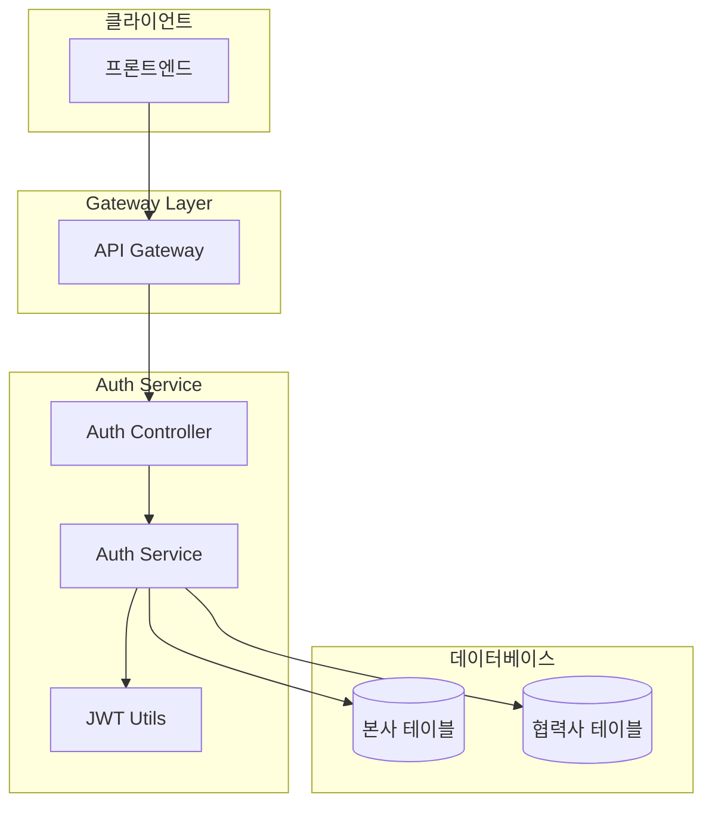
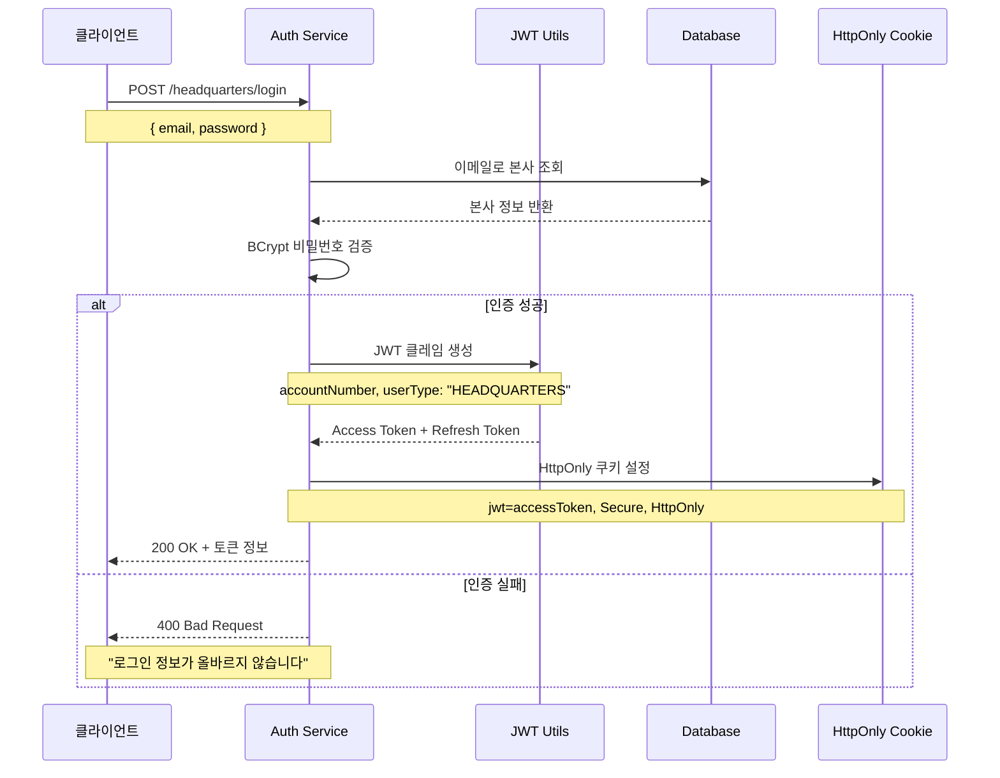
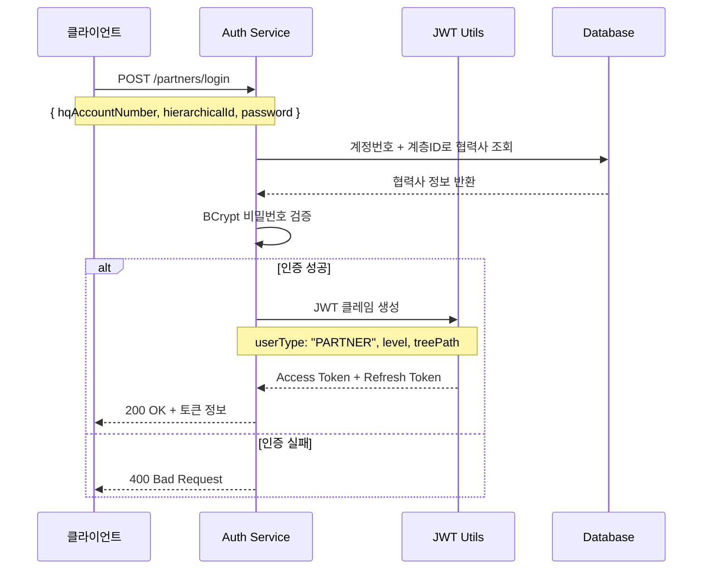
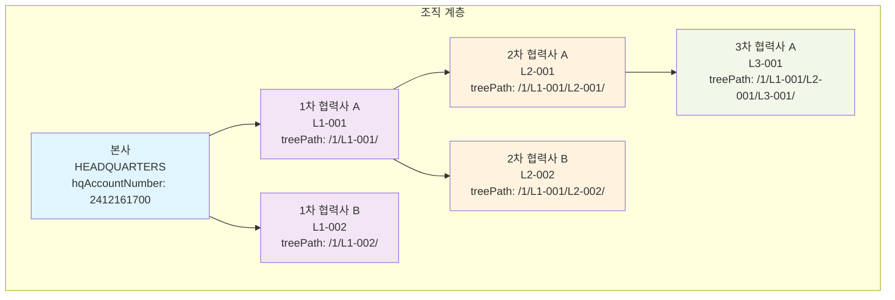
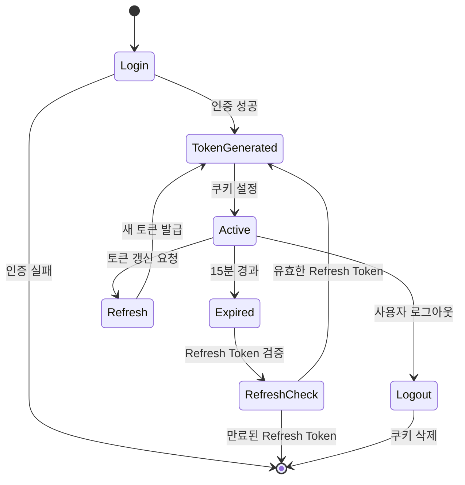

# Auth Service - ESG 프로젝트 인증/인가 서비스

## 서비스 개요

ESG 프로젝트의 **인증 및 인가를 담당하는 마이크로서비스**입니다. 본사와 협력사 간의 **계층적 조직 구조**를 지원하며, **JWT 기반의 안전한 인증 시스템**을 제공합니다.

### 주요 특징

- 이원화된 사용자 체계: 본사(Headquarters) + 협력사(Partner)
- 계층적 조직 구조: 본사 → 1차협력사 → 2차협력사 → 3차협력사
- JWT 기반 인증: HttpOnly 쿠키를 통한 안전한 토큰 관리
- 세밀한 권한 제어: TreePath 기반 계층적 접근 권한
- 보안 강화: BCrypt 암호화, XSS 방지, CSRF 보호

## 기술 스택

| 분야 | 기술 |
|------|------|
| **Framework** | Spring Boot 3.5.0 |
| **Security** | Spring Security 6.x, JWT |
| **Database** | MySQL 8.0, JPA/Hibernate |
| **Authentication** | JWT (Access/Refresh Token) |
| **Password** | BCrypt (strength 12) |
| **Documentation** | Swagger/OpenAPI 3.0 |

## 시스템 아키텍처



## 인증 플로우

### 본사 로그인 시퀀스



### 협력사 로그인 시퀀스



## 계층적 조직 구조



### 권한 체계

| 사용자 타입 | 접근 범위 | 설명 |
|------------|-----------|------|
| **본사** | 전체 계층 | 모든 협력사 데이터 접근 가능 |
| **1차 협력사** | 본인 + 하위 | 본인 + 2차/3차 협력사 데이터 접근 |
| **2차 협력사** | 본인 + 하위 | 본인 + 3차 협력사 데이터 접근 |
| **3차 협력사** | 본인만 | 본인 데이터만 접근 가능 |

## JWT 토큰 생명주기



## 보안 설계

### JWT 토큰 구조 예시

```json
{
  "header": {
    "alg": "HS512",
    "typ": "JWT"
  },
  "payload": {
    "sub": "2412161700",
    "accountNumber": "2412161700", 
    "companyName": "삼성전자",
    "userType": "HEADQUARTERS",
    "level": null,
    "treePath": null,
    "headquartersId": 1,
    "partnerId": null,
    "iat": 1640995200,
    "exp": 1640998800
  }
}
```

### 보안 특징

1. **HttpOnly 쿠키**: XSS 공격 방지
2. **Secure 플래그**: HTTPS 환경에서만 전송
3. **SameSite=Strict**: CSRF 공격 방지
4. **BCrypt 암호화**: 비밀번호 안전 저장 (strength 12)
5. **토큰 만료**: Access Token 15분, Refresh Token 7일

## 데이터베이스 설계

```mermaid
erDiagram
    headquarters {
        bigint headquarters_id PK
        varchar headquarters_uuid UK
        varchar hq_account_number UK
        varchar company_name
        varchar email UK
        varchar password
        varchar name
        varchar department
        varchar position
        varchar phone
        text address
        enum status
        datetime created_at
        datetime updated_at
    }
    
    partners {
        bigint partner_id PK
        varchar partner_uuid UK
        bigint headquarters_id FK
        bigint parent_partner_id FK
        varchar hq_account_number
        varchar hierarchical_id
        varchar company_name
        varchar password
        int level
        varchar tree_path
        enum status
        boolean password_changed
        datetime created_at
        datetime updated_at
    }
    
    headquarters ||--o{ partners : "관리"
    partners ||--o{ par/tners : "상하위관계"
```

## API 엔드포인트

### 본사 관리 API

| Method | Endpoint | 설명 | 인증 |
|--------|----------|------|------|
| POST | `/api/v1/auth/headquarters/register` | 본사 회원가입 | 불필요 |
| POST | `/api/v1/auth/headquarters/login` | 본사 로그인 | 불필요 |
| POST | `/api/v1/auth/headquarters/logout` | 본사 로그아웃 | 불필요 |
| GET | `/api/v1/auth/headquarters/me` | 현재 사용자 정보 | 필요 |
| GET | `/api/v1/auth/headquarters/by-uuid/{uuid}` | UUID로 본사 조회 | 불필요 |
| GET | `/api/v1/auth/headquarters/check-email` | 이메일 중복 확인 | 불필요 |

### 협력사 관리 API

| Method | Endpoint | 설명 | 인증 |
|--------|----------|------|------|
| POST | `/api/v1/auth/partners/create-by-uuid` | 협력사 생성 | 필요 |
| POST | `/api/v1/auth/partners/login` | 협력사 로그인 | 불필요 |
| POST | `/api/v1/auth/partners/logout` | 협력사 로그아웃 | 불필요 |
| GET | `/api/v1/auth/partners/me` | 현재 사용자 정보 | 필요 |
| GET | `/api/v1/auth/partners/tree` | 계층 구조 조회 | 필요 |
| PUT | `/api/v1/auth/partners/initial-password` | 초기 비밀번호 변경 | 불필요 |

## 핵심 구현 특징

### 1. 계층적 ID 시스템

- **본사**: `hqAccountNumber` (예: 2412161700)
- **협력사**: `hqAccountNumber-hierarchicalId` (예: 2412161700-L1-001)

### 2. TreePath 기반 권한 제어

```
본사: /1/
1차: /1/L1-001/
2차: /1/L1-001/L2-001/
3차: /1/L1-001/L2-001/L3-001/
```

### 3. 불변성 보장 엔티티

모든 엔티티 수정은 새로운 객체 생성을 통해 불변성을 보장합니다.

## 성능 최적화

### 인덱스 전략

- `idx_headquarters_uuid`: UUID 기반 조회
- `idx_tree_path`: 계층 구조 조회
- `idx_hq_account_hierarchical`: 복합 인덱스로 로그인 성능 향상

### 보안 최적화

- Connection Pool 최적화
- JWT 토큰 크기 최소화
- 세션 비활성화로 수평 확장 지원

---

**기술적 성과**
- 복잡한 계층적 조직 구조를 TreePath 알고리즘으로 효율적 구현
- JWT + HttpOnly Cookie로 XSS/CSRF 방지하는 보안 아키텍처 설계
- Spring Security 메서드 레벨 보안으로 세밀한 권한 제어 구현
- 불변성 보장 엔티티 설계로 데이터 일관성 확보