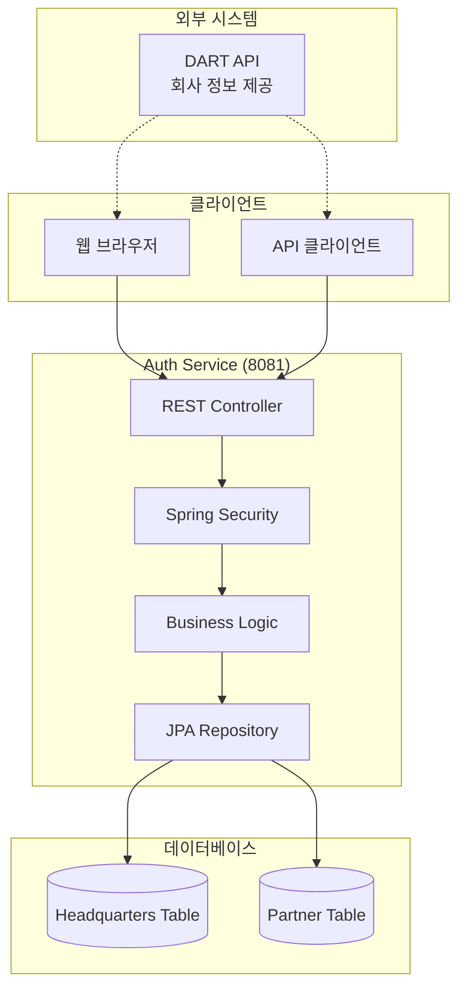
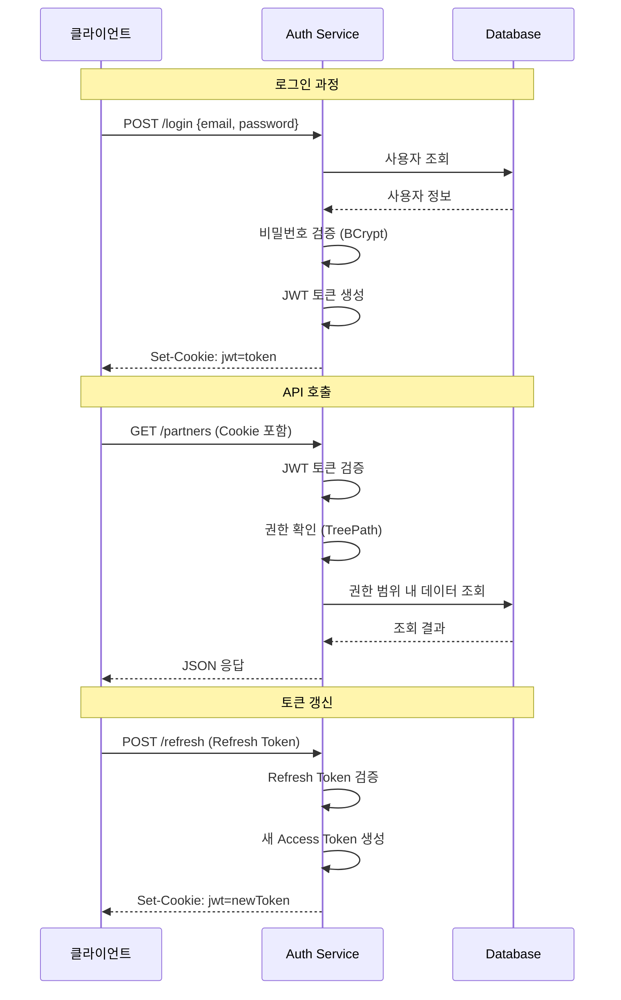

# ESG Auth Service

> JWT 기반 계층적 조직 인증 서비스

[](https://spring.io/projects/spring-boot)
[](https://spring.io/projects/spring-security)
[](https://openjdk.java.net/projects/jdk/17/)

## 프로젝트 개요

ESG 데이터 관리를 위한 본사-협력사 간 계층적 권한 관리 시스템입니다. DART API로부터 받은 회사 정보를 기반으로 협력사를 생성하고, 각 조직의 레벨에 따른 데이터 접근 권한을 제어합니다.

## 기술 스택

- **Backend**: Spring Boot 3.5.0, Spring Security, Spring Data JPA
- **Database**: MySQL 8.0
- **Authentication**: JWT (Access + Refresh Token)
- **Security**: BCrypt Password Encoding, HttpOnly Cookie
- **Documentation**: OpenAPI 3.0 (Swagger)

## 핵심 기능

### 1. 조직 관리

- 본사 회원가입 및 계정 관리
- UUID 기반 협력사 생성 (DART API 연동)
- 다단계 협력사 구조 지원 (1차, 2차, 3차...)

### 2. 인증 시스템

- JWT 기반 stateless 인증
- Access Token (15분) + Refresh Token (7일)
- HttpOnly Cookie를 통한 XSS 보안

### 3. 권한 관리

- 계층적 권한 제어 (TreePath 시스템)
- 본사: 모든 협력사 데이터 접근
- 협력사: 본인 + 직속 하위 조직만 접근

## 시스템 아키텍처



## 인증 플로우



## 계층적 권한 시스템

### TreePath 구조

```
본사: /HQ001/
├── 1차 협력사: /HQ001/L1-001/
│   ├── 2차 협력사: /HQ001/L1-001/L2-001/
│   └── 2차 협력사: /HQ001/L1-001/L2-002/
└── 1차 협력사: /HQ001/L1-002/
    └── 2차 협력사: /HQ001/L1-002/L2-001/
```

### 권한 제어 로직

```java
@PreAuthorize("@securityUtil.canAccessPartnerData(#partnerId)")
public List<PartnerResponse> getAccessiblePartners() {
    String currentTreePath = securityUtil.getCurrentTreePath();
    return partnerRepository.findAccessiblePartners(currentTreePath);
}
```

## 주요 API

### 본사 관리

```bash
# 본사 회원가입
POST /api/v1/headquarters/signup
{
  "companyName": "현대자동차",
  "email": "admin@hyundai.com",
  "password": "Hyundai123!",
  "name": "김철수",
  "department": "ESG팀",
  "position": "팀장"
}

# 로그인
POST /api/v1/headquarters/login
{
  "email": "admin@hyundai.com",
  "password": "Hyundai123!"
}
```

### 협력사 관리

```bash
# 협력사 생성 (UUID 기반)
POST /api/v1/partners/create-by-uuid
{
  "uuid": "550e8400-e29b-41d4-a716-446655440000",
  "contactPerson": "박영희",
  "companyName": "현대모비스",
  "address": "서울시 강남구"
}

# 협력사 목록 조회 (권한별)
GET /api/v1/partners/accessible

# 특정 협력사 조회
GET /api/v1/partners/uuid/{uuid}
```

## 기술적 구현 포인트

### 1. JWT 보안 구현

- Access Token과 Refresh Token 분리
- HttpOnly Cookie로 XSS 방어
- SameSite=Strict로 CSRF 방어

### 2. 계층적 권한 관리

```java
// TreePath를 이용한 권한 검증
@Query("SELECT p FROM Partner p WHERE p.treePath LIKE CONCAT(:treePath, '%')")
List<Partner> findAccessiblePartners(@Param("treePath") String treePath);
```

### 3. 자기참조 관계 매핑

```java
@Entity
public class Partner {
    @ManyToOne(fetch = FetchType.LAZY)
    @JoinColumn(name = "parent_partner_id")
    private Partner parentPartner;

    @OneToMany(mappedBy = "parentPartner")
    private Set<Partner> childPartners = new HashSet<>();
}
```

### 4. 비밀번호 보안

- BCrypt 암호화 (strength: 12)
- 초기 비밀번호 강제 변경 시스템
- 비밀번호 정책 검증

## 데이터베이스 설계

### Headquarters 테이블

```sql
CREATE TABLE headquarters (
    id BIGINT AUTO_INCREMENT PRIMARY KEY,
    uuid VARCHAR(36) UNIQUE NOT NULL,
    company_name VARCHAR(255) NOT NULL,
    email VARCHAR(255) UNIQUE NOT NULL,
    password VARCHAR(255) NOT NULL,
    name VARCHAR(100) NOT NULL,
    department VARCHAR(100),
    position VARCHAR(50),
    phone VARCHAR(20),
    address TEXT,
    status VARCHAR(20) DEFAULT 'ACTIVE',
    created_at TIMESTAMP DEFAULT CURRENT_TIMESTAMP,
    updated_at TIMESTAMP DEFAULT CURRENT_TIMESTAMP ON UPDATE CURRENT_TIMESTAMP
);
```

### Partner 테이블

```sql
CREATE TABLE partner (
    id BIGINT AUTO_INCREMENT PRIMARY KEY,
    uuid VARCHAR(36) UNIQUE NOT NULL,
    headquarters_id BIGINT NOT NULL,
    parent_partner_id BIGINT,
    company_name VARCHAR(255) NOT NULL,
    email VARCHAR(255),
    password VARCHAR(255) NOT NULL,
    contact_person VARCHAR(100) NOT NULL,
    address TEXT,
    tree_path TEXT NOT NULL,
    level INT NOT NULL,
    status VARCHAR(20) DEFAULT 'PENDING',
    is_initial_password BOOLEAN DEFAULT TRUE,
    created_at TIMESTAMP DEFAULT CURRENT_TIMESTAMP,
    updated_at TIMESTAMP DEFAULT CURRENT_TIMESTAMP ON UPDATE CURRENT_TIMESTAMP,
    FOREIGN KEY (headquarters_id) REFERENCES headquarters(id),
    FOREIGN KEY (parent_partner_id) REFERENCES partner(id)
);
```

## 실행 방법

### 환경 설정

```bash
# 환경 변수 설정
export DB_URL=jdbc:mysql://localhost:3306/esg_auth
export DB_USERNAME=root
export DB_PASSWORD=your_password
export JWT_SECRET=your-jwt-secret-key
```

### 애플리케이션 실행

```bash
# 데이터베이스 생성
mysql -u root -p -e "CREATE DATABASE esg_auth;"

# 애플리케이션 실행
./gradlew bootRun

# API 문서 확인
open http://localhost:8081/swagger-ui.html
```

## 테스트 시나리오

### 1. 본사 계정 생성 및 로그인

```bash
# 본사 회원가입
curl -X POST http://localhost:8081/api/v1/headquarters/signup \
  -H "Content-Type: application/json" \
  -d '{"companyName":"현대자동차","email":"admin@hyundai.com","password":"Hyundai123!","name":"김철수"}'

# 로그인 (쿠키 저장)
curl -X POST http://localhost:8081/api/v1/headquarters/login \
  -H "Content-Type: application/json" \
  -c cookies.txt \
  -d '{"email":"admin@hyundai.com","password":"Hyundai123!"}'
```

### 2. 협력사 생성 및 관리

```bash
# 1차 협력사 생성
curl -X POST http://localhost:8081/api/v1/partners/create-by-uuid \
  -H "Content-Type: application/json" \
  -b cookies.txt \
  -d '{"uuid":"550e8400-e29b-41d4-a716-446655440000","contactPerson":"박영희","companyName":"현대모비스","address":"서울시"}'

# 협력사 목록 조회
curl -X GET http://localhost:8081/api/v1/partners/accessible \
  -b cookies.txt
```

## 개발 환경

- **IDE**: IntelliJ IDEA
- **JDK**: OpenJDK 17
- **Build Tool**: Gradle 8.x
- **Database**: MySQL 8.0 (Local Development)

---

**주요 구현 특징**

- JWT 기반 stateless 인증으로 확장성 확보
- TreePath 알고리즘으로 효율적인 계층 권한 관리
- Spring Security 커스터마이징으로 복잡한 권한 체계 구현
- JPA 자기참조 관계로 무한 깊이 조직 구조 지원
