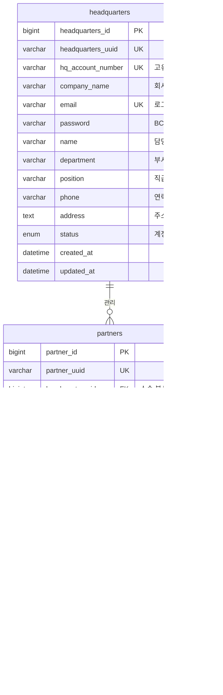

# Auth Service - JWT 기반 계층적 인증/인가 시스템

**포트폴리오 프로젝트**: ESG 플랫폼 - 마이크로서비스 인증 시스템

## 프로젝트 개요

Auth Service는 ESG 플랫폼의 **인증 및 인가를 담당하는 마이크로서비스**입니다. 본사와 협력사 간의 **계층적 조직 구조**를 지원하며, **JWT 기반의 안전한 인증 시스템**을 제공합니다.

### 핵심 기능

- **이원화된 사용자 체계**: 본사(Headquarters) + 협력사(Partner) 관리
- **계층적 조직 구조**: 본사 → 1차협력사 → 2차협력사 → 3차협력사
- **JWT 기반 인증**: HttpOnly 쿠키를 통한 안전한 토큰 관리
- **TreePath 권한 제어**: 계층적 접근 권한 시스템
- **보안 강화**: BCrypt 암호화, XSS/CSRF 방지

### 기술 스택

- **Framework**: Spring Boot 3.5.0
- **Security**: Spring Security 6.x + JWT
- **Database**: MySQL 8.0 + JPA/Hibernate
- **Authentication**: JWT (Access/Refresh Token)
- **Password Encryption**: BCrypt (strength 12)
- **Documentation**: Swagger/OpenAPI 3.0

## 시스템 아키텍처

### 마이크로서비스 구조


### 인증 서비스 내부 구조


## 인증 플로우

### 본사 로그인 시퀀스


### 협력사 로그인 시퀀스


### JWT 토큰 생명주기


## 계층적 조직 구조

### 조직 계층 다이어그램


### 권한 체계

| 사용자 타입 | TreePath 예시 | 접근 범위 | 설명 |
|-------------|---------------|-----------|------|
| **본사** | `/1/` | 전체 계층 | 모든 협력사 데이터 접근 가능 |
| **1차 협력사** | `/1/L1-001/` | 본인 + 하위 | 본인 + 2차/3차 협력사 데이터 접근 |
| **2차 협력사** | `/1/L1-001/L2-001/` | 본인 + 하위 | 본인 + 3차 협력사 데이터 접근 |
| **3차 협력사** | `/1/L1-001/L2-001/L3-001/` | 본인만 | 본인 데이터만 접근 가능 |

## 데이터 모델

### 핵심 엔티티 관계



## 보안 설계

### JWT 토큰 구조

```json
{
  "header": {
    "alg": "HS512",
    "typ": "JWT"
  },
  "payload": {
    "sub": "2412161700",
    "accountNumber": "2412161700", 
    "companyName": "삼성전자",
    "userType": "HEADQUARTERS",
    "level": null,
    "treePath": "/1/",
    "headquartersId": 1,
    "partnerId": null,
    "iat": 1640995200,
    "exp": 1640998800
  },
  "signature": "HMACSHA512(base64UrlEncode(header) + '.' + base64UrlEncode(payload), secret)"
}
```

### 보안 특징

- **HttpOnly 쿠키**: XSS 공격 방지
- **Secure 플래그**: HTTPS 환경에서만 전송
- **SameSite=Strict**: CSRF 공격 방지
- **BCrypt 암호화**: 비밀번호 안전 저장 (strength 12)
- **토큰 만료**: Access Token 15분, Refresh Token 7일
- **계층적 권한**: TreePath 기반 접근 제어

### TreePath 권한 알고리즘

```java
// TreePath 기반 권한 검증 예시
public boolean hasAccessToPath(String userTreePath, String targetTreePath) {
    // 사용자의 TreePath가 대상 경로의 상위이거나 동일한 경우 접근 허용
    return targetTreePath.startsWith(userTreePath);
}

// 예시:
// 본사(/1/)는 모든 하위 경로(/1/L1-001/, /1/L1-001/L2-001/) 접근 가능
// 1차 협력사(/1/L1-001/)는 자신과 하위(/1/L1-001/L2-001/) 접근 가능
```

## API 문서

### 주요 엔드포인트

#### 본사 관리 API

| HTTP Method | Endpoint | 설명 | 인증 | 응답 |
|-------------|----------|------|------|------|
| POST | `/api/v1/auth/headquarters/register` | 본사 회원가입 | 불필요 | HeadquartersSignupResponse |
| POST | `/api/v1/auth/headquarters/login` | 본사 로그인 | 불필요 | TokenResponse + Cookie |
| POST | `/api/v1/auth/headquarters/logout` | 본사 로그아웃 | 불필요 | Success Message |
| GET | `/api/v1/auth/headquarters/me` | 현재 사용자 정보 | 필요 | HeadquartersResponse |
| GET | `/api/v1/auth/headquarters/by-uuid/{uuid}` | UUID로 본사 조회 | 불필요 | HeadquartersResponse |
| GET | `/api/v1/auth/headquarters/check-email` | 이메일 중복 확인 | 불필요 | Boolean |

#### 협력사 관리 API

| HTTP Method | Endpoint | 설명 | 인증 | 응답 |
|-------------|----------|------|------|------|
| POST | `/api/v1/auth/partners/create-by-uuid` | 협력사 생성 | 필요 | PartnerCreateResponse |
| POST | `/api/v1/auth/partners/login` | 협력사 로그인 | 불필요 | TokenResponse + Cookie |
| POST | `/api/v1/auth/partners/logout` | 협력사 로그아웃 | 불필요 | Success Message |
| GET | `/api/v1/auth/partners/me` | 현재 사용자 정보 | 필요 | PartnerResponse |
| GET | `/api/v1/auth/partners/tree` | 계층 구조 조회 | 필요 | List<PartnerResponse> |
| PUT | `/api/v1/auth/partners/initial-password` | 초기 비밀번호 변경 | 불필요 | Success Message |

### Swagger UI

서비스 실행 후 `http://localhost:8081/swagger-ui.html`에서 API 문서 확인 가능

## 실행 방법

### 개발 환경 구성

```bash
# 핵심 서비스 시작
./backend/run-core-services.sh

# Auth 서비스 실행
cd backend/auth-service
./gradlew bootRun
```

### 환경 변수 설정

```yaml
# application.yml
spring:
  application:
    name: auth-service
  config:
    import: optional:configserver:http://localhost:8888

server:
  port: 8081

jwt:
  secret: ${JWT_SECRET:defaultSecret}
  access-token-expiration: 900000  # 15분
  refresh-token-expiration: 604800000  # 7일
```

## 테스트

```bash
# 단위 테스트 실행
./gradlew test

# 통합 테스트 실행
./gradlew integrationTest

# 보안 테스트 실행
./gradlew securityTest
```

## 핵심 구현 특징

### 1. 계층적 ID 시스템

- **본사**: `hqAccountNumber` (예: 2412161700)
- **협력사**: `hqAccountNumber-hierarchicalId` (예: 2412161700-L1-001)

### 2. TreePath 기반 권한 제어

```
본사: /1/
1차: /1/L1-001/
2차: /1/L1-001/L2-001/
3차: /1/L1-001/L2-001/L3-001/
```

### 3. 불변성 보장 엔티티

모든 엔티티 수정은 새로운 객체 생성을 통해 불변성을 보장합니다.

### 4. 메서드 레벨 보안

```java
@PreAuthorize("hasRole('HEADQUARTERS') or (hasRole('PARTNER') and #partnerId == authentication.credentials.partnerId)")
public PartnerResponse getPartnerById(Long partnerId) {
    // 메서드 실행
}
```

## 성능 최적화

### 인덱스 전략

```sql
-- 복합 인덱스로 로그인 성능 향상
CREATE INDEX idx_hq_account_hierarchical ON partners(hq_account_number, hierarchical_id);

-- UUID 기반 조회 최적화
CREATE UNIQUE INDEX idx_headquarters_uuid ON headquarters(headquarters_uuid);

-- TreePath 계층 구조 조회 최적화
CREATE INDEX idx_tree_path ON partners(tree_path);
```

### 메모리 및 보안 최적화

- **Connection Pool 최적화**: HikariCP 설정
- **JWT 토큰 크기 최소화**: 필수 클레임만 포함
- **세션 비활성화**: Stateless 설계로 수평 확장 지원
- **BCrypt 워크 팩터**: 보안과 성능의 균형 (strength 12)

## 주요 특징

- **확장성**: 마이크로서비스 아키텍처로 독립적 스케일링
- **보안성**: 다층 보안 설계 (JWT + HttpOnly Cookie + BCrypt)
- **유연성**: 계층적 조직 구조 지원으로 복잡한 비즈니스 요구사항 대응
- **성능**: 인덱스 최적화 및 효율적인 권한 검증 알고리즘
- **모니터링**: 상세한 로깅 및 예외 처리

---

**기술적 성과**:
- 복잡한 계층적 조직 구조를 TreePath 알고리즘으로 효율적 구현
- JWT + HttpOnly Cookie로 XSS/CSRF 방지하는 보안 아키텍처 설계  
- Spring Security 메서드 레벨 보안으로 세밀한 권한 제어 구현
- 불변성 보장 엔티티 설계로 데이터 일관성 확보

**개발자**: ESG Project Team  
**버전**: 3.0  
**최종 업데이트**: 2024-12-20